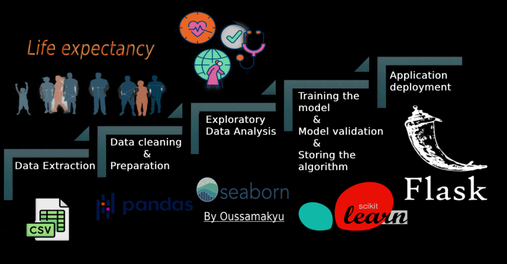

# Life Expectancy

This is a machine learning model for predicting life expectancy based on various features and factors. The model is trained on a dataset containing information about different countries and their corresponding life expectancy.

 

## Table of Contents
- [Dataset](#dataset)
- [Model Training](#model-training)
- [Installation](#installation)
- [Usage](#usage)
- [Contributing](#contributing)
- [License](#license)

## Dataset

The dataset used for training the model is the World Health Organization's (WHO) Global Health Observatory (GHO) data. It includes features such as:

- Status (Developing or Developed)
- Adult Mortality
- Infant Deaths
- Alcohol Consumption
- Percentage Expenditure
- Hepatitis B Vaccination Coverage
- Measles Cases
- BMI (Body Mass Index)
- Under-five Deaths
- Polio Vaccination Coverage
- Total Expenditure on Health
- Diphtheria Vaccination Coverage
- HIV/AIDS Prevalence
- GDP (Gross Domestic Product)
- Population
- Thinness in 1-19 Years
- Thinness in 5-9 Years
- Income Composition of Resources
- Schooling
The Global Health Observatory (GHO) data repository under World Health Organization (WHO) keeps track of the health status as well as many other related factors for all countries The data-sets are made available to public for the purpose of health data analysis. The data-set related to life expectancy, health factors for 193 countries has been collected from the same WHO data repository website and its corresponding economic data was collected from United Nation website. Among all categories of health-related factors only those critical factors were chosen which are more representative. It has been observed that in the past 15 years , there has been a huge development in health sector resulting in improvement of human mortality rates especially in the developing nations in comparison to the past 30 years. Therefore, in this project we have considered data from year 2000-2015 for 193 countries for further analysis. The individual data files have been merged together into a single data-set. On initial visual inspection of the data showed some missing values. As the data-sets were from WHO, we found no evident errors. Missing data was handled in R software by using Missmap command. The result indicated that most of the missing data was for population, Hepatitis B and GDP. The missing data were from less known countries like Vanuatu, Tonga, Togo, Cabo Verde etc. Finding all data for these countries was difficult and hence, it was decided that we exclude these countries from the final model data-set. The final merged file(final dataset) consists of 22 Columns and 2938 rows which meant 20 predicting variables. All predicting variables was then divided into several broad categories:​Immunization related factors, Mortality factors, Economical factors and Social factors.

## Model Training

The model is trained using a machine learning algorithm called multiple linear regression to predict the life expectancy based on the provided features. The dataset is preprocessed and split into training and testing sets to evaluate the model's performance.

## Installation

To install the life expectancy model, follow these steps:

1. Clone the repository:
git clone https://github.com/Oussamakyu/Life-Expectancy.git

2. Activate the virtual environment:
conda activate "Path to venv"

3. Install the required libraries:
pip install -r requirements.txt

## Usage

1. Run the application:
python app.py

**Note:** If you encounter any errors while running the app, run the following command:
pip install scikit-learn

2. Open your web browser and visit the following link: [http://127.0.0.1:5000](http://127.0.0.1:5000)

3. Make your predictions using the provided input fields.

## Contributing

Contributions to this project are welcome. You can contribute by following these steps:

1. Fork the repository.
2. Create a new branch.
3. Make your changes.
4. Commit your changes.
5. Push the branch to your forked repository.
6. Open a pull request.

## License

This project is licensed under the [Apache License ](LICENSE).

---

By: Oussama BENABBOU

## Contact me : 
benabbou.osama@gmail.com
